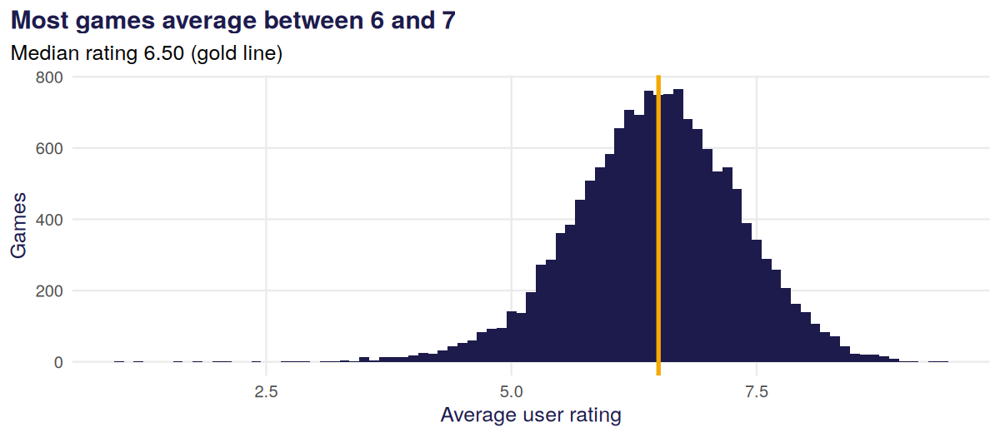
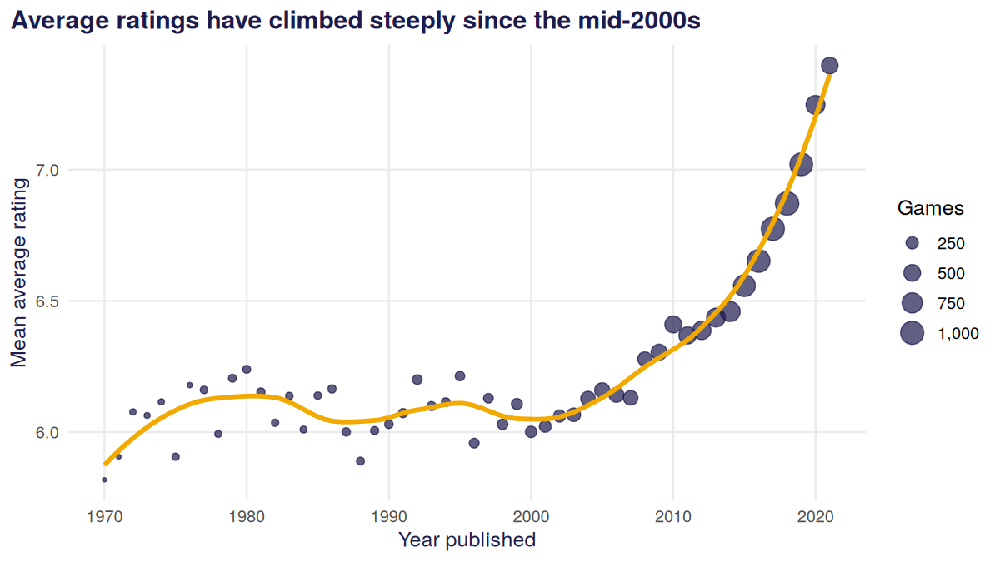
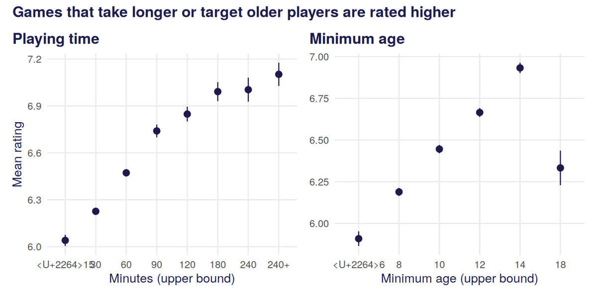
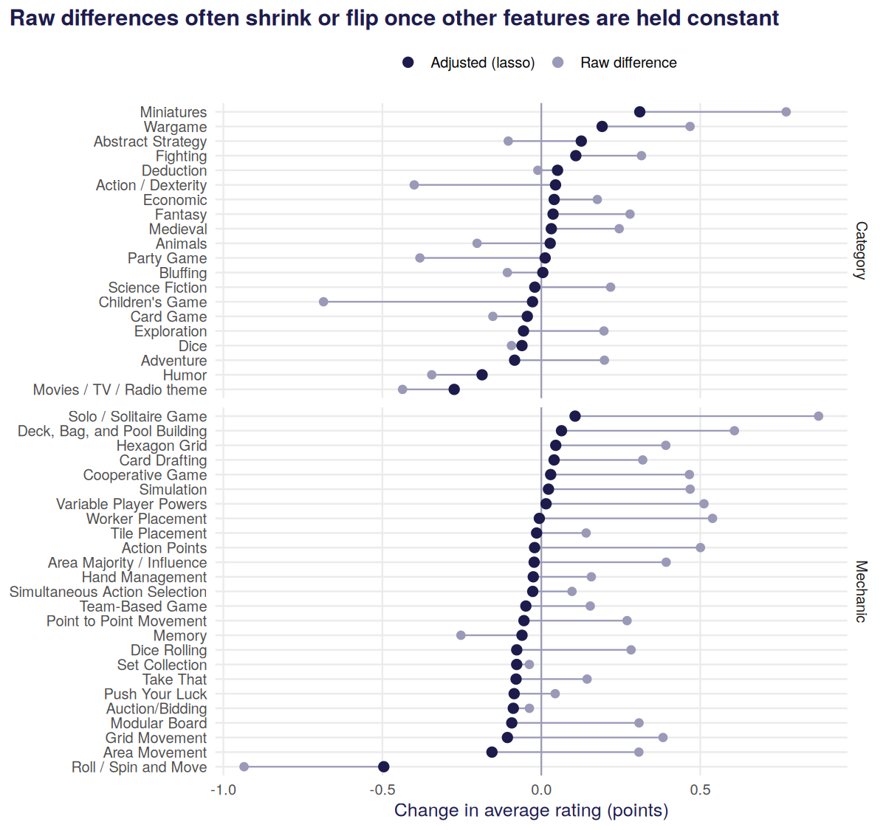
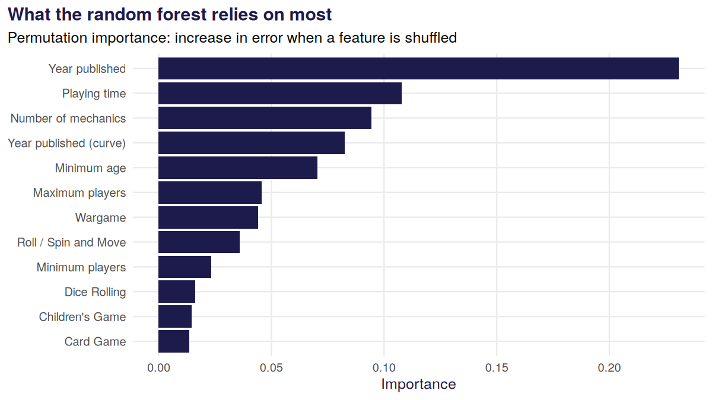
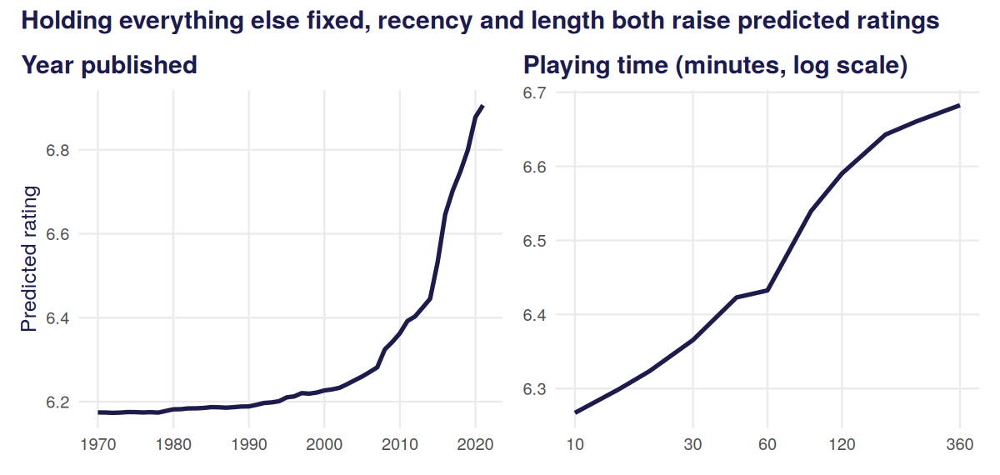

What makes a board game highly rated?
================

**Question.** BoardGameGeek users have rated tens of thousands of games.
Which features of a game, such as its length, player count, mechanics
and themes, go with higher ratings? And how well can we predict a game’s
rating before anyone has played it?

This analysis uses the [TidyTuesday BoardGameGeek
data](https://github.com/rfordatascience/tidytuesday/tree/master/data/2022/2022-01-25),
cleaned by `R/prepare_data.R`, and the model functions in `R/model.R`.

``` r
library(tidyverse)
library(glmnet)
library(ranger)
library(patchwork)
source("R/model.R")

ink <- "#1D1B4C"; gold <- "#F2A900"; blue <- "#2F45C9"; grey <- "#9A99B8"
theme_set(
  theme_minimal(base_size = 12) +
    theme(plot.title = element_text(face = "bold", colour = ink),
          plot.title.position = "plot",
          axis.title = element_text(colour = ink), panel.grid.minor = element_blank())
)

games  <- read_csv("data/games.csv", show_col_types = FALSE)
labels <- read_csv("data/feature_labels.csv", show_col_types = FALSE)
```

## 1. The data

After cleaning, there are **15,249 games** published between 1970 and
2021, each with at least 50 user ratings. The outcome is the game’s
average user rating on BoardGameGeek’s 1 to 10 scale.

``` r
ggplot(games, aes(average)) +
  geom_histogram(binwidth = 0.1, fill = ink) +
  geom_vline(xintercept = median(games$average), colour = gold, linewidth = 1.2) +
  labs(title = "Most games average between 6 and 7",
       subtitle = sprintf("Median rating %.2f (gold line)", median(games$average)),
       x = "Average user rating", y = "Games")
```



## 2. Newer games are rated much higher

``` r
by_year <- games |>
  group_by(year) |>
  summarise(mean_rating = mean(average), n = n())

ggplot(by_year, aes(year, mean_rating)) +
  geom_point(aes(size = n), colour = ink, alpha = 0.7) +
  geom_smooth(method = "loess", se = FALSE, colour = gold, linewidth = 1.3, span = 0.4) +
  scale_size_area(max_size = 6, labels = scales::comma) +
  labs(title = "Average ratings have climbed steeply since the mid-2000s",
       x = "Year published", y = "Mean average rating", size = "Games")
```



Games from the 1990s average about 6.1, while games from 2020 average
about 7.3. That is unlikely to mean games simply got that much better.
Newer games are mostly rated by the enthusiasts who sought them out,
while older games have been rated by a broader, more critical audience
over many years. **Any model of ratings has to account for release
year**, or it will mistake “recent” for “good”.

## 3. Longer, more demanding games rate higher

``` r
p1 <- games |>
  mutate(time_bin = cut(playing_time, c(0, 15, 30, 60, 90, 120, 180, 240, 600),
                        labels = c("≤15", "30", "60", "90", "120", "180", "240", "240+"))) |>
  group_by(time_bin) |>
  summarise(m = mean(average), se = sd(average) / sqrt(n())) |>
  ggplot(aes(time_bin, m)) +
  geom_pointrange(aes(ymin = m - 1.96 * se, ymax = m + 1.96 * se), colour = ink) +
  labs(title = "Playing time", x = "Minutes (upper bound)", y = "Mean rating")

p2 <- games |>
  mutate(age_bin = cut(min_age, c(0, 6, 8, 10, 12, 14, 18),
                       labels = c("≤6", "8", "10", "12", "14", "18"))) |>
  group_by(age_bin) |>
  summarise(m = mean(average), se = sd(average) / sqrt(n())) |>
  ggplot(aes(age_bin, m)) +
  geom_pointrange(aes(ymin = m - 1.96 * se, ymax = m + 1.96 * se), colour = ink) +
  labs(title = "Minimum age", x = "Minimum age (upper bound)", y = NULL)

p1 + p2 + plot_annotation(title = "Games that take longer or target older players are rated higher",
                          theme = theme(plot.title = element_text(face = "bold", colour = ink)))
```



## 4. Which mechanics and themes matter, once everything else is accounted for?

Raw comparisons can mislead. Wargames, for example, tend to be long,
which is itself linked to higher ratings. So I compare each feature’s
**raw** difference (games with it versus without it) with its
**adjusted** effect from a lasso regression that holds year, length,
age, player count and all other features constant.

``` r
split  <- split_data(games)
lasso  <- fit_lasso(split$train)
forest <- fit_forest(split$train)
```

``` r
raw <- labels |>
  mutate(raw_diff = map_dbl(column, \(c) mean(games$average[games[[c]] == 1]) -
                                        mean(games$average[games[[c]] == 0])),
         share = map_dbl(column, \(c) mean(games[[c]])))

co <- coef(lasso, s = "lambda.min")
adjusted <- tibble(column = rownames(co), adjusted = as.numeric(co[, 1]))

effects <- raw |>
  left_join(adjusted, by = "column") |>
  mutate(term = fct_reorder(term, adjusted))

ggplot(effects, aes(y = term)) +
  geom_vline(xintercept = 0, colour = grey) +
  geom_segment(aes(x = raw_diff, xend = adjusted, yend = term), colour = grey) +
  geom_point(aes(x = raw_diff, colour = "Raw difference"), size = 2.2) +
  geom_point(aes(x = adjusted, colour = "Adjusted (lasso)"), size = 2.8) +
  scale_colour_manual(values = c("Raw difference" = grey, "Adjusted (lasso)" = ink)) +
  facet_grid(type ~ ., scales = "free_y", space = "free_y") +
  labs(title = "Raw differences often shrink or flip once other features are held constant",
       x = "Change in average rating (points)", y = NULL, colour = NULL) +
  theme(legend.position = "top")
```



``` r
effects |>
  arrange(desc(adjusted)) |>
  slice(c(1:5, (n() - 4):n())) |>
  transmute(Feature = as.character(term), Type = type,
            `Share of games` = scales::percent(share, 1),
            `Raw difference` = round(raw_diff, 2),
            `Adjusted effect` = round(adjusted, 2)) |>
  knitr::kable()
```

| Feature                   | Type     | Share of games | Raw difference | Adjusted effect |
|:--------------------------|:---------|:---------------|---------------:|----------------:|
| Miniatures                | Category | 5%             |           0.77 |            0.31 |
| Wargame                   | Category | 15%            |           0.47 |            0.19 |
| Abstract Strategy         | Category | 7%             |          -0.10 |            0.13 |
| Fighting                  | Category | 9%             |           0.32 |            0.11 |
| Solo / Solitaire Game     | Mechanic | 5%             |           0.87 |            0.11 |
| Grid Movement             | Mechanic | 8%             |           0.38 |           -0.11 |
| Area Movement             | Mechanic | 6%             |           0.31 |           -0.16 |
| Humor                     | Category | 6%             |          -0.34 |           -0.19 |
| Movies / TV / Radio theme | Category | 5%             |          -0.44 |           -0.27 |
| Roll / Spin and Move      | Mechanic | 6%             |          -0.94 |           -0.50 |

- **Roll / Spin and Move** is the clearest negative: about 0.9 points
  lower raw, and still 0.5 lower after adjustment, matching its
  reputation as a luck-driven mechanic.
- **Miniatures (+0.31) and wargames (+0.19)** keep positive effects,
  reflecting dedicated hobbyist audiences. **Licensed film and TV themes
  (−0.27)** and **humour (−0.19)** stay negative.
- **Many “modern” mechanics look great raw but not once adjusted.**
  Worker placement, deck building and variable player powers are each
  rated about half a point higher raw, but almost all of that disappears
  after adjustment: these games are simply newer and longer. The same is
  true in reverse for children’s games.

## 5. Predicting a game’s rating

I compare a baseline that always predicts the average rating, a lasso
regression and a random forest, on a 20% held-out test set of 3,050
games.

``` r
results <- evaluate(split$test, split$train, lasso, forest)
results |>
  mutate(rmse = round(rmse, 3), r_squared = round(r_squared, 3)) |>
  rename(Model = model, RMSE = rmse, `R²` = r_squared) |>
  knitr::kable()
```

| Model                     |  RMSE |     R² |
|:--------------------------|------:|-------:|
| Baseline (average rating) | 0.843 | -0.002 |
| Lasso regression          | 0.613 |  0.471 |
| Random forest             | 0.574 |  0.536 |

The random forest explains about half the variation in ratings using
only information available before release, and cuts the typical error
from 0.84 to 0.57 rating points. The lasso is a little less accurate but
fully interpretable, so it powers the interactive app.

``` r
imp <- tibble(feature = names(forest$variable.importance),
              importance = forest$variable.importance) |>
  slice_max(importance, n = 12) |>
  left_join(labels, by = c("feature" = "column")) |>
  mutate(label = coalesce(term, recode(feature,
    year_c = "Year published", year_c2 = "Year published (curve)",
    log2_time = "Playing time", min_age = "Minimum age", max_players = "Maximum players",
    min_players = "Minimum players", n_mechanics = "Number of mechanics")),
    label = fct_reorder(label, importance))

ggplot(imp, aes(importance, label)) +
  geom_col(fill = ink) +
  labs(title = "What the random forest relies on most",
       subtitle = "Permutation importance: increase in error when a feature is shuffled",
       x = "Importance", y = NULL)
```



``` r
pd_year <- partial_dependence(forest, split$train, "year_c", seq(-4, 1.1, by = 0.1)) |>
  mutate(value = 2010 + 10 * value)
pd_time <- partial_dependence(forest, split$train, "log2_time", log2(c(10, 15, 20, 30, 45, 60, 90, 120, 180, 240, 360))) |>
  mutate(value = 2^value)

q1 <- ggplot(pd_year, aes(value, prediction)) + geom_line(colour = ink, linewidth = 1.2) +
  labs(title = "Year published", x = NULL, y = "Predicted rating")
q2 <- ggplot(pd_time, aes(value, prediction)) + geom_line(colour = ink, linewidth = 1.2) +
  scale_x_log10(breaks = c(10, 30, 60, 120, 360)) +
  labs(title = "Playing time (minutes, log scale)", x = NULL, y = NULL)
q1 + q2 + plot_annotation(title = "Holding everything else fixed, recency and length both raise predicted ratings",
                          theme = theme(plot.title = element_text(face = "bold", colour = ink)))
```



## 6. Conclusions

- **Release year is the single strongest predictor**, most likely
  because recent games are rated by self-selected enthusiasts. Comparing
  games from different eras on raw ratings is unfair to older titles.
- **Longer, more demanding games rate higher**, with ratings rising
  steadily with playing time and recommended age.
- **Mechanics matter, but less than raw averages suggest.** After
  adjustment, roll-and-move is the clearest negative and miniatures,
  wargames and solo play the clearest positives.
- **Ratings are partly predictable before release**: a random forest
  explains about half the variation.

**Limitations.** These are associations, not causal effects: adding
miniatures to a game will not by itself raise its rating. BoardGameGeek
raters are a self-selected hobbyist community, so the results describe
what *that* audience likes. Only the 25 most common mechanics and 20
most common categories are modelled, and game complexity (BGG’s
“weight”) is not in this dataset.
